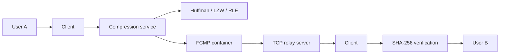

# Архитектура

Система разделена на независимые слои: algorithms реализует кодеки, container хранит FCMP, service выполняет файловые операции, transfer отвечает за TCP relay, а GUI/CLI являются адаптерами интерфейса.

Core-слой не зависит от GUI и сети, поэтому алгоритмы тестируются отдельно.
