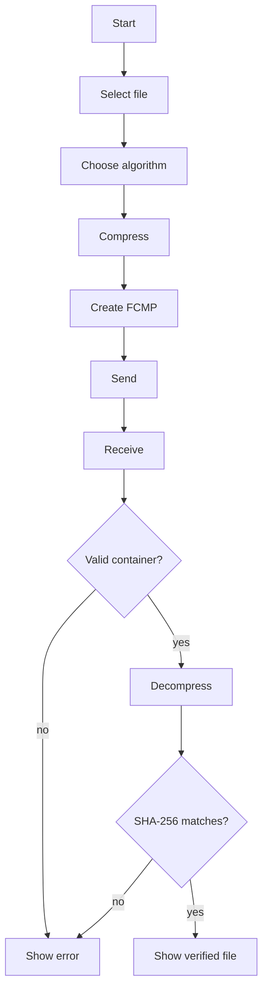

```mermaid
flowchart TD
  Start --> Select[Select file]
  Select --> Algorithm[Choose algorithm]
  Algorithm --> Compress[Compress]
  Compress --> Container[Create FCMP]
  Container --> Send[Send]
  Send --> Receive[Receive]
  Receive --> Validate{Valid container?}
  Validate -- no --> Error[Show error]
  Validate -- yes --> Decompress[Decompress]
  Decompress --> Check{SHA-256 matches?}
  Check -- no --> Error
  Check -- yes --> Done[Show verified file]
```