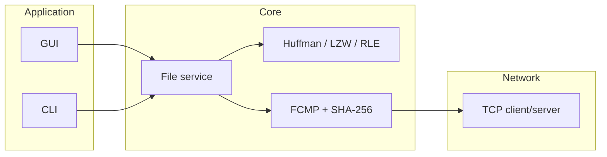

```mermaid
flowchart LR
  subgraph Application
    GUI[GUI]
    CLI[CLI]
  end
  subgraph Core
    Algorithms[Huffman / LZW / RLE]
    FCMP[FCMP + SHA-256]
    Service[File service]
  end
  subgraph Network
    TCP[TCP client/server]
  end
  GUI --> Service
  CLI --> Service
  Service --> Algorithms
  Service --> FCMP
  FCMP --> TCP
```