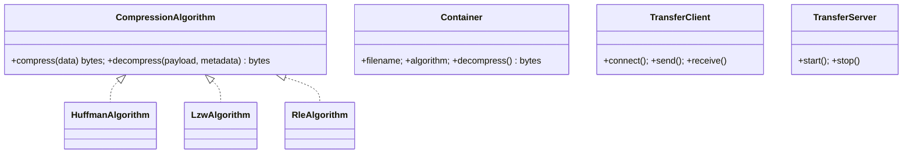

```mermaid
classDiagram
  class CompressionAlgorithm { +compress(data) bytes; +decompress(payload, metadata) bytes }
  class HuffmanAlgorithm
  class LzwAlgorithm
  class RleAlgorithm
  CompressionAlgorithm <|.. HuffmanAlgorithm
  CompressionAlgorithm <|.. LzwAlgorithm
  CompressionAlgorithm <|.. RleAlgorithm
  class Container { +filename; +algorithm; +decompress() bytes }
  class TransferClient { +connect(); +send(); +receive() }
  class TransferServer { +start(); +stop() }
```