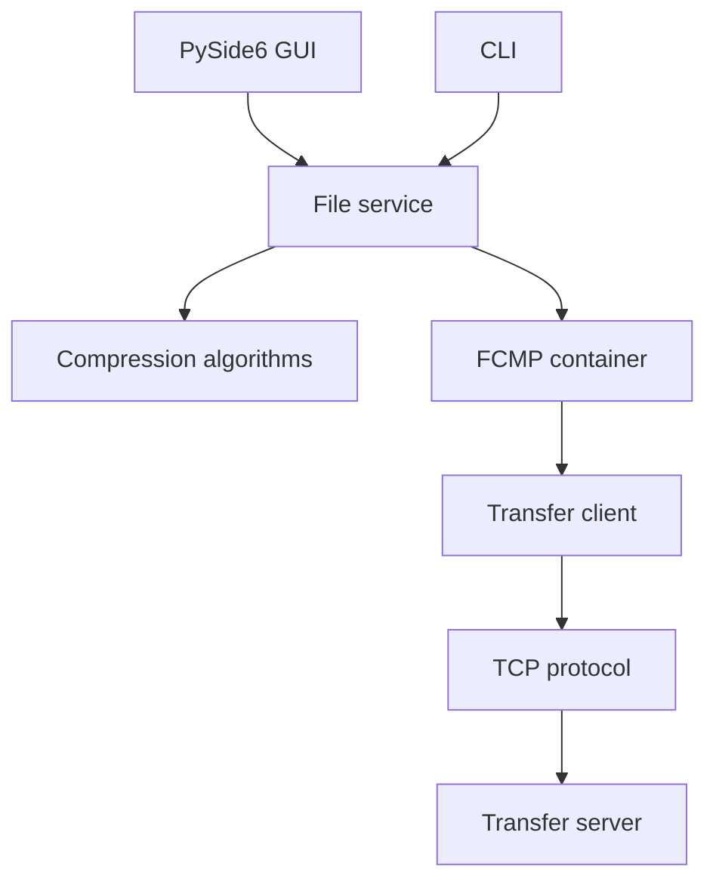

```mermaid
flowchart TB
  GUI[PySide6 GUI] --> Service[File service]
  CLI[CLI] --> Service
  Service --> Algorithms[Compression algorithms]
  Service --> Container[FCMP container]
  Client[Transfer client] --> Protocol[TCP protocol]
  Protocol --> Server[Transfer server]
  Container --> Client
```