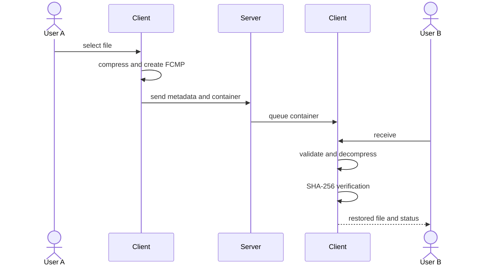

```mermaid
sequenceDiagram
  actor A as User A
  participant CA as Client
  participant S as Server
  participant CB as Client
  actor B as User B
  A->>CA: select file
  CA->>CA: compress and create FCMP
  CA->>S: send metadata and container
  S->>CB: queue container
  B->>CB: receive
  CB->>CB: validate and decompress
  CB->>CB: SHA-256 verification
  CB-->>B: restored file and status
```